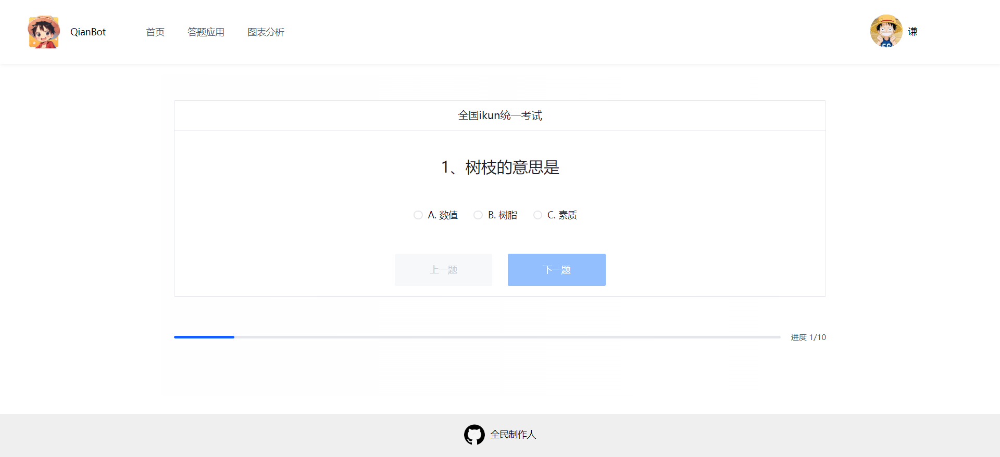
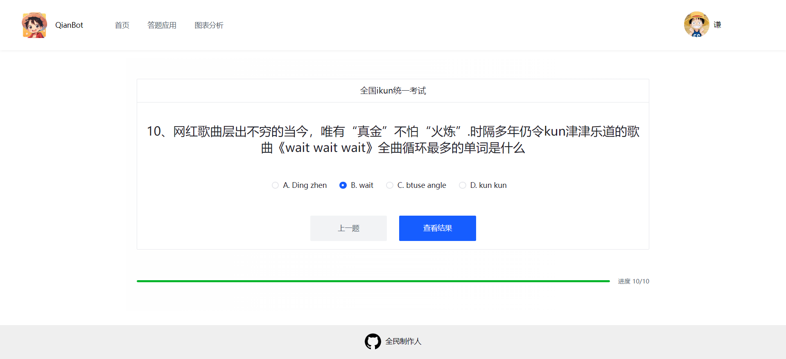

# QianBot

> By：[zgh-qian](https://github.com/zgh-qian)
>
> 项目体验地址：https://zgh.icu
>
> 项目技术栈：Vue 3 + Spring Boot + Redis + ChatGLM AI + SSE + COS
[toc]

## 项目简介

### 项目介绍

当你探索网站时，你将发现一个丰富多样的**答题应用**，涵盖从MBTI性格测试到趣味性问答的各种选择。

不仅如此，**智能图表分析**功能允许你上传文件，通过AI技术进行深入分析，帮助你揭示数据背后的洞见和趋势。

无论你是寻找娱乐放松，还是需要数据驱动的决策支持，网站都能为你提供令人满意的解决方案。探索你的潜力，了解你的数据，尽在平台上。

[【速戳】快来试试答题应用！！！](https://zgh.icu/app)

[【速戳】快来试试图表分析！！！](https://zgh.icu/chart)

[欢迎访问GitHub仓库](https://github.com/zgh-qian)

### 核心业务流程图

#### 应用答题流程

#### 图表分析流程

## 页面说明

### 页面展示

首页

答题应用

图表分析

用户中心

答题历史

图表历史

我的应用

### 应用答题流程

点击感兴趣的应用

点击开始答题

最后点击查看结果，等待评分

评分完成后，跳转结果页面

### 创建应用流程

点击头像，点击我的应用

点击制作应用

输入应用信息

**应用类型**分为得分类和测评类

* 得分类就像考试做试卷，每个选项会有分数
* 测评类就像MBTI这种，每个选项对应了一种属性，比如INSJ

**评分策略**分为自定义和AI

* 自定义需要自己设置评分规则，设置评分规则是为得到最后的结果页面
* AI 就是直接让AI处理答题情况，如果设置了评分规则则不生效

设置题目和选项

题目

* 题目标题就是用户看见的题目
* 可以选择使用 AI 生成，帮你快速生成题目
  * 一键生成就是一次性返回直接生成对应数量的题目，等待时间比较长
  * 实时生成利用了 SSE ，可以实时生成一道一道题目，单次等待比较长

选项

* 选项Key就是选项前面的序号，比如 A B C D
* 选项内容就是用户看见的选项
* 选项结果就是得分或者属性（仅支持一个值，可以是字符串和数字）

设置评分

评分说明：

* 得分类应用：设置结果得分，比如只设置90，那么高于90的都是这个结果；如果设置了90和80的话，得分90结果就是90
* 测评类应用：一个规则可以设置多个属性

### 图表分析流程

点击上传文件

选择格式为xlsx或xls的文件

点击下一步

选择图表类型

填写图表信息

确认图表信息

点击生成图表

等待生成图表

生成图表成功

